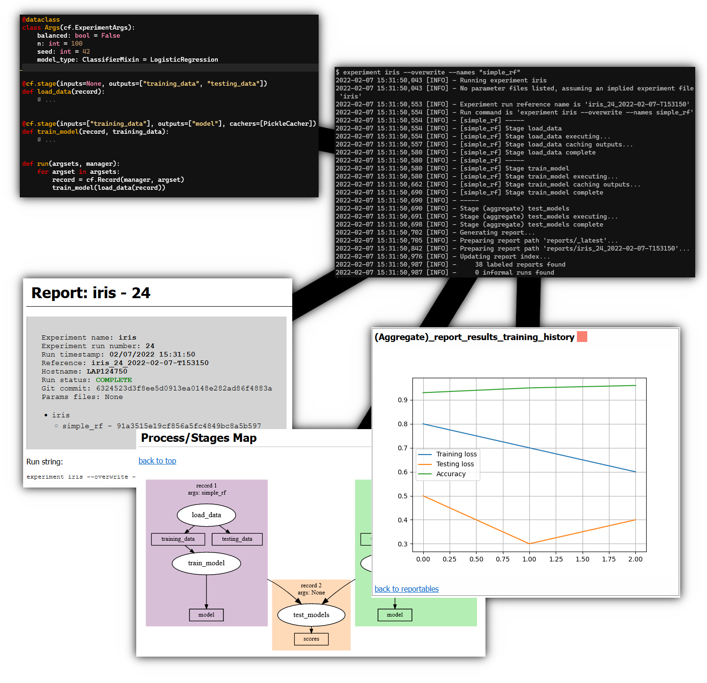

# Curifactory

[](https://github.com/psf/black)

Curifactory is a library and CLI tool designed to help organize and manage
research experiments in python.



Experiment management requires several aspects, including experiment orchestration,
parameterization, caching, reproducibility, reporting, and parallelization.
Existing projects such as MLFlow, MetaFlow, Luigi, and Pachyderm
support these aspects in several different ways and to various degrees.
Curifactory provides a different opinion to these, with a heavier focus on supporting general
research experiment workflows for individuals or small teams working primarily
in python.

## Features

* Adds a CLI layer on top of your codebase, a single entrypoint for running experiments
* Automatic caching of intermediate data and lazy loading of stored objects
* Jupyter notebook output for further exploration of an experiment run
* Docker container output with copy of codebase, conda environment, full experiment run cache, and jupyter run notebook
* HTML report output from each run with graphviz-rendered diagram of experiment
* Easily report plots and values to HTML report
* Configuration files are python scripts, allowing programmatic definition, parameter composition, and parameter inheritance
* Output logs from every run
* Run experiments directly from CLI or other python code, notebooks, etc.


## Installation

```python
pip install curifactory
```

Graphviz is required for certain features and can be installed through conda
via:

```python
conda install python-graphviz
```

## Examples

Several small example projects can be found in the `examples` folder.
`examples/notebook-based` includes notebooks demonstrating usage of curifactory
solely in Jupyter. `examples/minimal` shows a basic single-file experiment
script.


## Documentation

[link]


## Citation
