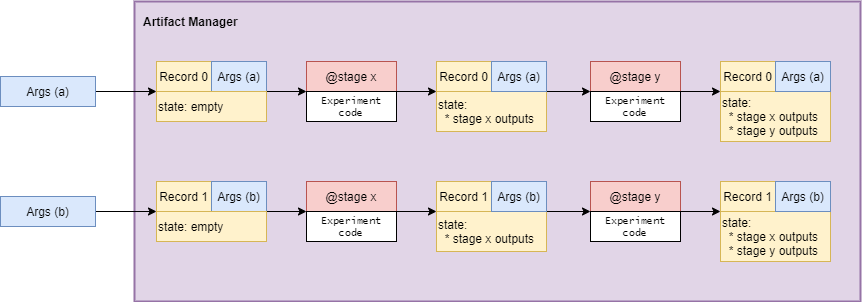

# Summary

Curifactory is a command line tool and framework for organizing Python experiment code, configuration parameters, and results reporting. It is an opinionated and lightweight approach to experiment infrastructure and is primarily intended to support researchers conducting experiments on one machine. This software was developed to support the reproducibility of results for several data science projects in the Nuclear Nonproliferation Division at Oak Ridge National Laboratory.

Curifactory is intended to be a general framework and is not specific to machine learning or data science. It can aid in any field in which experiments can be expressed and run through Python code (e.g., high-energy physics, astronomy, computational chemistry). The design emphasizes the automated caching of intermediate data analysis products to speed up computationally intensive tasks. It also allows for data provenance and experiment reproduction. Curifactory experiments can either be integrated into a project from the beginning or can be written on top of an existing codebase without needing much modification. Individual experiment runs are tracked through logs and their output reports, and entire copies of a run with all cached data can be exported for others to run using Curifactory on another machine. A few important views of the Curifactory library can be seen in \autoref{fig:curi_main}.

# Statement of Need

Experiment organization and results management are often overlooked aspects of conducting research with any significant amount of software code. Project folders can become a mess of temporary runnable scripts with inconsistent outputs and conflicting or outdated data files because of rapid code prototyping during research activities combined with the failure to manage intermediate experimental results (i.e., computationally expensive data transforms). This can make it difficult to track experiment results over time and greatly complicate the task of reproducing a set of results. Managing large collections of possible parameter sets for experiment code can also be challenging, sometimes requiring scripts to generate configuration files that can be difficult to update if argument changes occur later in the research lifecycle.

Various solutions have been implemented to address some aspects of research experiment management, and in prior work, the authors explored some of these solutions and detailed a set of attributes to consider for comparing such systems: orchestration, parameterization, caching, provenance, portability, reporting, and scalability [@martindale2022design]. We briefly explore three of those here, Kedro [@kedro] and MLFlow [@mlflow2022], as well as Pachyderm [@pacyderm2022] to highlight what distinguishes Curifactory and the types of problems it is suited for.

First, Curifactory is a more generalized approach to experiments. Tools such as Pachyderm and MLFlow are intentionally designed for machine learning models, whereas Curifactory makes no assumptions about the objective of an experiment or data analysis task. Pachyderm in particular is more complicated to set up
because it requires a Kubernetes cluster [@kubernetes2022]. In practice, this means that Pachyderm is better suited for use by a medium or large team in a production setting, rather than a team with one to three researchers. MLFlow differs in its abilities to configure parameters, relying on raw string key-value pairs. Curifactory, in contrast, directly handles configuration in Python files, allowing greater flexibility and dynamic parameter set construction. MLFlow also has no explicit means for orchestration, relying solely on the script in which it is run.

Curifactory is very similar to Kedro in terms of the abstractions it provides for orchestration. Kedro's "nodes" are functionally similar to Curifactory "stages," but Kedro's "pipelines" design stresses modularity and reusablility compared such that sections of code could be used easily across multiple projects. This is less of an emphasis in Curifactory's experiment design. Orchestration in these two systems differs in practice. Curifactory's approach focuses on the organization of multiple experiments within a project with the goal of minimizing the amount of mental overhead needed to track each type of experiment. Kedro is designed to support one primary experiment per project with pipelines that are easily shared between projects. The two tools also take two different approaches for caching and reporting. Curifactory caches and reports information based on a specific set of parameters run through a select experiment. This makes re-entrancy through caching easier for a given experiment and parameter set. Kedro, on the other hand, does not explicitly cache by default. Finally, the two projects differ in their preferred file approach for parameterization. Curifactory uses Python configuration files for parameterizing experiments while Kedro focuses on a YAML-based system by default.

# Workflow

The development team created Curifactory using assumptions about the high-level concepts discussed in this section. The first of these conceptualizations is that of a stage, which functionally represents one step in an experimental process. The stage function should be used to make calls into researcher-specific code and orchestrate the movement of data between stages with parameters.

Another core concept of Curifactory is a parameter, which is the Python file that contains any kind of configuration information needed to run a stage. Rather than relying on typical configuration file formats (e.g., YAML, JSON) to determine what data files to use or what hyperparameters to select in a model, Curifactory assumes that this type of information is stored in a Python dataclass. Significant advantages to keeping this type of information in code rather than in a more typical formation include the following (1) a parameter can store any Python object, (2) parameter sets can be modular/compositional, (3) parameter sets can inherit from another parameter set, and (4) parameter sets can be dynamically generated. This allows researchers to, for example, generate an experiment-wide parameter grid search, potentially generating hundreds of parameters from a single file.

Finally, an experiment is Python code that takes in a collection of parameter sets and routes them through one or more sequences of stages to run a whole experiment. Experiments have a manager that is available throughout a run, which helps maintain the state of data passing through the various stages. These interactions are shown in \autoref{fig:components}. Experiments represent the different discrete analysis task that a researcher may want to try. For example, a researcher might have an experiment that tests which type of data-driven model converges best for a scenario of interest.

Researchers can interact with Curifactory on the command line through the ``experiment`` command. This interface allows researchers to specify an experiment to run and the set(s) of parameters to apply to that experiment. Various flags control Curifactory’s functionality, such as whether an experiment Jupyter Notebook summary is automatically generated at the end, whether to ignore some specific parameters, and whether to parallelize experiment execution.

# Audience

The target audience for curifactory is small research teams performing multiple data analysis tasks as part of a research activity. This could include activities like graduate research, business analysis tasks, or scientific experimentation. This open-source software is licensed under a BSD-3 clause license, is registered on [DOE Code](https:// doi:10.11578/dc.20220208.1), and is available on [GitHub](https://github.com/ORNL/curifactory). The package is also pip installable with ``pip install curifactory`` with Sphinx [@sphinx] built [documentation](https://ornl.github.io/curifactory/latest/index.html). Finally, linting for this project is performed using black [@black-linter] and flake8 [@flake8] as well as other pre-commit hooks with pre-commit [@precommit].

# Acknowledgments

The authors would like to acknowledge the US Department of Energy, National Nuclear Security Administration's Office of Defense Nuclear Nonproliferation Research and Development (NA-22) for supporting this work.

This manuscript has been authored by UT-Battelle, LLC, under contract DE-AC05-00OR22725 with the US Department of Energy (DOE). The US government retains and the publisher, by accepting the article for publication, acknowledges that the US government retains a nonexclusive, paid-up, irrevocable, worldwide license to publish or reproduce the published form of this manuscript, or allow others to do so, for US government purposes. DOE will provide public access to these results of federally sponsored research in accordance with the DOE Public Access Plan (http://energy.gov/downloads/doe-public-access-plan).

# References
