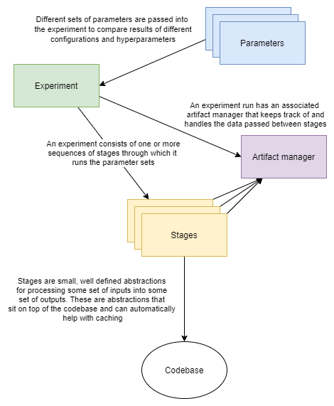
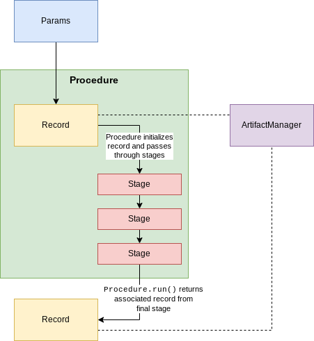

Components
==========

    Experiments route parameters into lists of stages, stages route relevant
    parameters into codebase calls. An artifact manager tracks information
    from the experiment run and all the data passed between stages.

**Stages** - A stage is a small, well-defined abstraction for processing some set of inputs into some set of outputs.
These abstractions sit on top of the codebase, and can automatically cache outputs.

.. code-block:: python

    @stage(...)
    def clean_data(...):
        # ...
        return cleaned_data

**Procedures** - A procedure is a list of stages to run in sequence for a given parameter set. An example of a procedure might be to
load, clean, and split a dataset, and then train and test a model with it. Procedures are defined inside of experiments. Procedures
are simply an alternative way to running stages than the functional form.

.. code-block:: python

    proc = Procedure([
        get_data,
        clean_data,
        split_data,
        train_model,
        test_model
    ], ...)

**Parameter sets** - Parameter sets represent a specific collection (list of argsets) of configuration values or adjustable parameters for the stage functions
to apply to the functions called in the codebase.

**Records** - A record is a collection of data/variables used in a single run of a procedure with a single paramset.
A record is automatically passed between stages of a procedure in order to persist the information. The currently
active record is passed into every stage, so a stage has manual access to everything stored in it.

**Artifact Manager** - An artifact manager instance is associated with each experiment run, and it tracks and handles all intermediate
outputs from the various stages. The manager is the overarching collection of records for an experiment run.
It tracks all records for each procedure/paramset
used. A stage with an aggregate decorator can get access to all records instead of just the currently active one in
the procedure in order to aggregate results or other data across the records.

**Experiments** - Experiments apply given sets of parameters to one or more procedures, potentially running additional aggregate stages
to collect and analyze results from multiple procedure runs across parameter sets. The intention of an experiment is
to allow easy comparison of results for multiple similar procedures and/or multiple parameter configurations across one
or more procedures.

Component interactions
----------------------

The below sections describe how the different components interact with and flow through each other.

Stage flow
..........

.. figure:: images/interactions_stage.png
    :align: center

A stage is the processing of a record. A record has a :code:`state` attribute, which is a dictionary
of data from previous stages. A stage which requires input automatically finds those input variables from the passed :code:`record.state` and
passes them into the function,
and the outputs are stored from the returns back into :code:`record.state`. A record is initialized with some :code:`Args` parameter
set, and the record itself has an associated artifact manager.

Note that the four components here, args, records, stages, and a manager are the minimum components required
to interact with Curifactory. Procedures and experiments are helpful but not required, and you could for
instance run stages on their own with just these four components in a jupyter notebook or similar.
(However, most of the benefit of Curifactory comes from the experiment management side through the
experiment CLI, which minimally requires using experiments as well.)

Procedure flow
..............

Procedures simplify calling multiple stages. A procedure is defined with a list of these stages, and then
calling :code:`proc.run(args)` while passing in an :code:`Args` parameter set will automatically create an associated
record, store it in the manager, and then execute the sequence of stages as a pipeline on the record.
The output is the final record, which could also be accessed as :code:`manager.records[-1]`, since it was the
last record added to the manager.

Note that the :code:`run()` function optionally takes a record as a parameter, which if passed will use the existing record
rather than creating a new one, meaning multiple procedures can technically be chained.

Experiment flow
...............

.. figure:: images/interactions_experiment.png
    :align: center

    Note that this is a simplified example of an experiment running a single procedure. You can in principle
    define an experiment run function to be as complex as needed.

An experiment is a relatively free-form way of defining one or more procedures (or manually running stages) to run on any number
of passed parameter sets. The code for an experiment is user-defined, but the Curifactory :code:`experiment` CLI
expects an experiment script to take a passed list of :code:`Args` instances and an artifact manager, and provides
many additional tools for working with and getting output from the experiment runs.

Running a procedure on multiple different parameter sets adds a record to the manager for each one. This
allows for comparison between the results by getting the records through :code:`manager.records`.

Anatomy of a stage
------------------

The :code:`@stage` decorator is placed on every stage function, and this handles passing in the appropriate input parameters
from the record, storing new outputs in the record, and checking for previously cached outputs (short-circuiting if so),
and caching returned results from the function.

Every stage function is expected to take a :code:`Record` instance as the first parameter. (Procedures automatically handle this.)
The stage will return the modified record rather than the direct output of the function the stage is decorating. The direct
function output can be obtained from :code:`record.output` on the returned record.

The decorator itself accepts three parameters: :code:`inputs`, :code:`outputs`, and optionally :code:`cachers`. The :code:`inputs` and :code:`outputs`
parameters are arrays of strings, where each string is the name of an artifact (piece of data) to retrieve or store on
the record.

.. figure:: images/curifactory_stage_explanation.png
    :align: center

The above example shows how decorator parameters interface with the function. The cachers, if specified,
direct the stage to store the order-respective output using that type of cacher. When the stage is running,
if it sees pre-cached data for all requested outputs, it will load and return those instead of evaluating
the function. (Unless overwrite has been specified in the passed arguments.)

Note that caching outputs is all or nothing, you cannot cache only some of them - if any cachers are given, one
must be given for every output.

Stage parameters
----------------

The functions that a stage wraps always take a record as their first argument. As
mentioned in previous sections, input names given in the stage inputs argument
must also show up as parameters in the function. The stage wrapper means that
you can manually call the stage function while only passing it the record, and
the stage will handle populating the remainder of these parameters:

.. code-block:: python

    @stage(inputs=["my_input"], ...)
    def some_stage(record, my_input):
        # ...

    some_stage(my_record)  # this is valid even though we pass nothing for my_input

The above snippet shows we don't need to pass (and the point of curifactory is
to not need to pass) anything in for :code:`my_input`. As long as a key
:code:`"my_input"` exists on the record's state, this stage will execute. If the
input key does not exist, a :code:`KeyError` is raised.

However, in some cases, we may not *strictly* need a value to be in the state
already, if our computation can gracefully handle it. Like a normal function, we
can specify default values for our parameters in the definition. Note that for
this to work, we must also instruct the stage to ignore missing input keys in
the state, which we do by setting the :code:`suppress_missing_inputs` flag:

.. code-block:: python

    @stage(inputs=["my_input"], ..., suppress_missing_inputs=True)
    def some_stage(record, my_input=None):
        # ...

    some_stage(my_record)

In the above case, the stage will still execute even if :code:`my_input` does
not exist, and inside the function its value will be :code:`None`.

We can also directly pass a specific value for a parameter when we call a stage,
like we would a normal function. Doing so negates the need for the
:code:`suppress_missing_inputs` flag, and would override a value from state if
one exists:

.. code-block:: python

    @stage(inputs=["my_input"], ...)
    def some_stage(record, my_input=None):
        # ...

    some_stage(my_record, my_input=42)

In this case, :code:`my_input` inside the stage code will be 42, regardless of
what it is in state (or even if it doesn't exist in state.)
