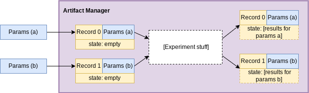

Getting Started
###############

Basic components
================

This section follows the `0_BasicComponents <https://github.com/ORNL/curifactory/blob/main/examples/notebook-based/notebooks/0_BasicComponents.ipynb>`_ notebook. We first
introduce the four basic components of curifactory and
show how to use them from a within a live context. (A live context is either a
notebook, REPL, or non-experiment script.)

These components are:

* the artifact manager
* parameters
* records
* stages

.. figure:: images/components_all.png
    :align: center

Artifact manager
----------------

First up is the **artifact manager**. ``ArtifactManager`` is a class
representing a session that tracks metadata and generated objects from
experiment code.

When an artifact manager is instantiated, it creates a new “experiment
run”, which will have an associated log file and can generate a run-specific
report.

.. code-block:: ipython3

    from curifactory import ArtifactManager

    manager = ArtifactManager("notebook_example_0") # we pass in a name to associate with this run.

.. figure:: images/components_manager.png
    :align: center

    The artifact manager contains and keeps track of the overall session for the experiment stuff.

Parameters
----------

The next component is **parameters**. Parameter classes are a way to
define how research code can be configured, e.g. how many layers to
include in a neural network. By defining and initializing these directly
in python, we have the ability to dynamically create experiment
parameter configurations, compose them, etc.

Curifactory comes with an ``ExperimentParameters`` base class that all
custom parameter classes should inherit from. ``ExperimentParameters``
includes a ``name`` parameter, allowing you to provide a label for the
parameter sets.

.. note::

    For best ergonomics, we recommend defining an parameter class with the python
    ``@dataclass`` decorator. This makes it easy to define defaults and
    quickly view your parameter definitions simply as a collection of
    attributes.

Parameter sets can then be initialized, passed around, and used within your
research code, making it easy to organize and keep track of hyperparameters.

.. code-block:: ipython3

    from dataclasses import dataclass
    from curifactory import ExperimentParameters

    @dataclass
    class MyParams(ExperimentParameters):
        some_scalar_multiplier: float = 1.0

    # define a couple argument sets
    default_params = MyParams(name="default")
    doubled_params = MyParams(name="doubled", some_scalar_multiplier=2.0)

    Creating and passing different parameter sets through the experiment stuff
    will give us different sets of results in the manager we can compare.

Records
-------

A **record** is how curifactory keeps track of state in an experiment
run. "State" includes the data, objects, and results associated with a specific
parameter set, e.g. a trained model that came from using a particular
``MyParams`` instance. The ``Record`` class is initialized with the
current manager as well as the argument set to use. Records
have a ``state`` dictionary, which holds intermediate data and objects
as research code is evaluated.

.. code-block:: ipython3

    from curifactory import Record

    r0 = Record(manager, default_params)
    r1 = Record(manager, doubled_params)

    print(r0.state, r0.params)
    #> {} MyParams(name='default', hash=None, overwrite=False, some_scalar_multiplier=1.0)
    print(r1.state, r1.params)
    #> {} MyParams(name='doubled', hash=None, overwrite=False, some_scalar_multiplier=2.0)

    The state for each record is what's actually storing the results from the
    experiment stuff for each given parameter set.

Stages
------

A **stage** represents a small, well-defined abstraction around portions
of research code which process some set of inputs and create a set of
outputs. A stage acts on a given record by taking the requested
inputs from that record’s state, evaluating some code, and returning values
that are then stored in the record’s state. This is implemented with a
``@stage`` decorator which takes an array of string input names and an
array of string output names. Functions with the ``@stage`` decorator
must accept a record as the first argument.

Inside the stage, the record object that is passed in can be used to get
the current parameter set and parameterize the computation,
via the ``record.params`` attribute.

In the example below, we’ve defined a very simple stage that will store
a number in the record’s state under the “initial_value” key.

Running a stage works by calling the function and passing it the
record. The record itself is changed in-place, but it is also
directly returned from the stage call. This allows functionally chaining
stages, which we demonstate later on.

.. code-block:: ipython3

    from curifactory import stage

    @stage(inputs=None, outputs=["initial_value"])
    def get_initial_value(record):
        my_value = 5
        return my_value * record.params.some_scalar_multiplier

    r0 = get_initial_value(r0)
    r1 = get_initial_value(r1)

After running both records through our stage, printing the states shows
the returned ``initial_value`` data.

.. code-block:: ipython3

    print(r0.state, r1.state)
    #> {'initial_value': 5.0} {'initial_value': 10.0}

.. figure:: images/components_stages.png
    :align: center

    Stages are the "experiment stuff". A stage uses and modifies the state of a passed record. This is where the
    experiment code actually runs, taking any necessary inputs from the passed
    record state and storing any returned outputs back into it.

Specifying inputs on the stage decorator tells curifactory to search for
those keys in the state of the passed record. Those values are then
injected into the record call as kwargs. Note that the argument names
in the function definition must match the string values of the inputs
array.

``"initial_value"`` was added to the state from the
``get_initial_value`` stage, so we implement a stage below that expects
that piece of data and computes a new value based on it.

.. code-block:: ipython3

    @stage(inputs=["initial_value"], outputs=["final_value"])
    def multiply_again(record, initial_value):
        return initial_value * record.params.some_scalar_multiplier

    r1 = multiply_again(r1)
    print(r1.state)
    #> {'initial_value': 10.0, 'final_value': 20.0}

As mentioned before, since a stage accepts and returns a record, stages
can be functionally chained together:

.. code-block:: ipython3

    r2 = Record(manager, MyParams(name="uber-double", some_scalar_multiplier=4.0))

    r2 = multiply_again(get_initial_value(r2))
    print(r2.state, r2.params)
    #> {'initial_value': 20.0, 'final_value': 80.0} MyParams(name='uber-double', hash=None, overwrite=False, some_scalar_multiplier=4.0)

    Records can be "pipelined" through sequences of stages to create a full
    experiment composed of larger abstract steps.

Records and stages represent linear chains of compute steps, but
in many cases it’s important to compare results and data across multiple pieces
of an experiment run (e.g. comparing the scores of an SVM with the
scores of a logistic regression algorithm.) ``@aggregate`` decorated
functions are a special kind of stage that additionally take a collection of
records to compute over. Aggregate stages still produce outputs and both take
and return a single record associated with it, meaning additional regular
stages can be chained after an aggregate stage.

We specify inputs to an ``@aggregate`` decorator the same way we do with
``@stage``, with a list of string names of artifacts from record state, and the
function definition still needs to have correspondingly named arguments for
those inputs. However, since an aggregate takes multiple records, these input
arguments are populated with dictionaries where each key is a record that has
the requested input in its state, and the value is that object in the state. Any
records that don't have the requested input will throw a warning, and will be
absent from that dictionary.

``@aggregate`` decorated stages must take the single record as the first parameter
(like a normal stage,) and the collection of records to compute over as the
second, followed by the arguments for any specified inputs.

In the example below, we iterate through the records to create a
dictionary of all associated ``final_value`` entries from each record’s
state, and then determine the maximum.

.. code-block:: ipython3

    from curifactory import aggregate

    @aggregate(inputs=["final_value"], outputs=["all_final_values", "maximum_value"])
    def find_maximum_final_value(record, records, final_value: dict[Record, float]):
        all_vals = {}
        for r, value in final_value.items():
            all_vals[r.params.name] = value

        maximum = max(all_vals.values())
        return all_vals, maximum

Sometimes an aggregate doesn't really need its own parameter set, e.g. if it's
simply comparing results from other records. In these cases, records can be initialized with ``None`` passed as the
parameter set. In the cell below, we manually pass our previous records into
the stage, but note that if we pass ``None`` for records (the default) it will take all existing records in the manager.

.. code-block:: ipython3

    final_record = Record(manager, None)
    final_record = find_maximum_final_value(final_record, [r0, r1, r2])
    print(final_record.state)
    #> {'all_final_values': {'doubled': 20.0, 'uber-double': 80.0}, 'maximum_value': 80.0}

Note that we ran our aggregate stage on three records, the first one of which
(``r0``) did not have a ``final_value`` artifact in state. While ``r0`` will still be
passed in the ``records`` list that the aggregate stage has access to, the
``final_value`` dictionary only had entries for ``r1`` and ``r2``, so the output
artifact ``all_final_values`` only lists those two parameter sets.

To recap, the artifact manager keeps track of the overall session for a
run, the “experiment run container”. Parameter sets are created with
different hyperparameters to test a hypothesis or vary the experiment.
Records track state changes and intermediate data associated with a
parameter set throughout the experiment. Stages are what modify record state,
they apply research code
to the passed records based on their associated parameters, and the
results for each stage are stored back into the record’s now modified
state.

.. figure:: images/components_all.png
    :align: center

Caching and reporting
=====================

..
    TODO: continue modifying params/args language below

This section follows the `1_CachingAndReporting <https://github.com/ORNL/curifactory/blob/main/examples/notebook-based/notebooks/1_CachingAndReporting.ipynb>`_ notebook. Here we demonstrate some features the previously discussed components
enable. Two major abilities are easily caching
objects (to short circuit computation of already-computed values) and
quickly adding graphs and other “reportables” to a jupyter
display or a generated HTML experiment run report.

First we create an artifact manager, an args class, and some arg sets like in
the previous example:

.. code-block:: ipython3

    from dataclasses import dataclass
    import curifactory as cf

    manager = cf.ArtifactManager("notebook_example_1")

    @dataclass
    class Args(cf.ExperimentArgs):
        my_parameter: int = 1

    default_args = Args(name="default")
    doubled_args = Args(name="doubled", my_parameter=2)

Caching
-------

Caching is done at each stage by listing a
``curifactory.Cacheable`` subclass for each output. After the stage
runs, each cacher will save the returned object in the data cache path.
The cached filename includes the name of the experiment (the string passed
to ``ArtifactManager``, “notebook_example_1” in this case), the hash
string of the arguments, the name of the stage doing the caching, and
the name of the output itself.

On any subsequent run of that stage, the cachers all check to see if
their file has already been created, and if it has, they directly load
the object from file and return it rather than running the stage code.

The ``@stage`` decorator has a ``cachers`` parameter which should be
given a list of the cachers to use for the associated
outputs list. Curifactory comes with a set of default cachers you can
use, including ``JsonCacher``, ``PandasCSVCacher``,
``PandasJsonCacher``, and ``PickleCacher``.

In the example below, we define a “long-running compute” stage, to
demonstrate cachers short-circuiting computation:

.. code-block:: ipython3

    from time import sleep
    from curifactory.caching import JsonCacher

    @cf.stage(inputs=None, outputs=["long-compute-data"], cachers=[JsonCacher])
    def long_compute_step(record):
        some_data = {
            "my_value": record.args.my_parameter,
            "magic_value": 42
        }
        sleep(5)  # making dictionaries is hard work
        return some_data

We run a record through our long running stage, and as expected it takes
5 seconds:

.. code-block:: ipython3

    %%time
    r0 = cf.Record(manager, default_args)
    r0 = long_compute_step(r0)

.. parsed-literal::

    CPU times: total: 0 ns
    Wall time: 5 s

Inspecting our cache path now, there’s a new json entry for our output,
which we can load up and see is the output from our stage:

.. code-block:: ipython3

    import json

    print(os.listdir("data/cache"))
    print()
    with open(f"data/cache/{os.listdir('data/cache')[0]}", 'r') as infile:
        print(json.load(infile))

.. parsed-literal::

    ['notebook_example_1_c504fab1c3ccad16d1e3ef540001172c_long_compute_step_long-compute-data.json']

    {'my_value': 1, 'magic_value': 42}

If we run the stage again with a record using the same arg set as the
previous one, it finds the correct cached output and returns before
running the stage code:

.. code-block:: ipython3

    %%time
    r1 = cf.Record(manager, default_args)
    r1 = long_compute_step(r1)

.. parsed-literal::

    CPU times: total: 0 ns
    Wall time: 0 ns

Using different arguments results in a different cache path, so
computations with different parameters won’t conflict:

.. code-block:: ipython3

    r2 = cf.Record(manager, doubled_args)
    r2 = long_compute_step(r2)

    os.listdir("data/cache")

.. parsed-literal::

    ['notebook_example_1_2c48da4b242c95c4eafac7e88872d319_long_compute_step_long-compute-data.json',
     'notebook_example_1_c504fab1c3ccad16d1e3ef540001172c_long_compute_step_long-compute-data.json']

Lazy loading
------------

One potential pitfall with caching is that it will always load
the object into memory, even if that object is never used. Projects with
very large data objects can run into memory problems as a result.
Curifactory includes a ``Lazy`` class that can wrap around a stage
output string name - when it is first computed, the cacher saves it and
the object is removed from memory (replaced in the record state with a
``Lazy`` instance.) When the lazy object is accessed, it will reload the
object into memory from cache at that point.

This means that in a sequence of stages where all values are cached,
earlier stage outputs may never need to load into memory at all.

.. code-block:: ipython3

    from curifactory.caching import Lazy
    import sys

    @cf.stage(inputs=None, outputs=[Lazy("very-large-object")], cachers=[JsonCacher])
    def make_mega_big_object(record):
        mega_big = [1]*1024*1024
        print(sys.getsizeof(mega_big))
        return mega_big

    r3 = cf.Record(manager, default_args)
    r3 = make_mega_big_object(r3)

.. code-block:: ipython3

    r3.state.resolve = False
    print(type(r3.state['very-large-object']))
    print(sys.getsizeof(r3.state['very-large-object']))

.. parsed-literal::

    <class 'curifactory.caching.Lazy'>
    48

Note that ``Record.state`` is actually a custom subclass of ``dict``,
and by default it will automatically resolve lazy objects any time they're
accessed on the state. the above cell turns this functionality off (with
``state.resolve = False``) to show that what’s actually in memory before
a resolved access is just the lazy object, which is significantly
smaller.

When the record’s state resolve is at it’s default value of ``True``:

.. code-block:: ipython3

    r3.state.resolve = True
    print(type(r3.state['very-large-object']))
    print(sys.getsizeof(r3.state['very-large-object']))

.. parsed-literal::

    <class 'list'>
    8697456

Reporting
---------

A major part of experiments for debugging, understanding, and
publishing them is the ability to present results and pretty graphs! This can be a
challenge to keep organized, as one tries to manage folders for
matplotlib graph images, result tables, and so on. Curifactory provides
shortcuts to easily create ``Reportable`` items from inside stages,
which the artifact manager can then display inside an experiment run report in its own uniquely named
run folder, which contains all of the information about the run, all of
the created reportables, and a map of the stages that were run. Many of
these report components can be rendered inside a notebook as well.

Every record has a ``report`` function that takes a ``Reportable``
subclass. Curifactory includes multiple default reporters, such as
``DFReporter``, ``FigureReporter``, ``HTMLReporter``, ``JsonReporter``,
and ``LinePlotReporter``.

.. code-block:: ipython3

    from curifactory.reporting import LinePlotReporter

    @cf.stage(inputs=None, outputs=["line_history"])
    def make_pretty_graphs(record):
        multiplier = record.args.my_parameter

        # here we just make a bunch of example arrays of data to plot
        line_0 = [1 * multiplier, 2 * multiplier, 3 * multiplier]
        line_1 = [3 * multiplier, 2 * multiplier, 1 * multiplier]
        line_2 = [4, 0, 3]

        # a LinePlotReporter makes a nicely formatted matplotlib graph
        record.report(LinePlotReporter(line_0, name="single_line_plot"))
        record.report(LinePlotReporter(
            y={
                "ascending": line_0,
                "descending": line_1,
                "static": line_2
            },
            name="multi_line_plot"
        ))
        return [line_0, line_1, line_2]

    r4 = cf.Record(manager, default_args)
    r5 = cf.Record(manager, doubled_args)

    r4 = make_pretty_graphs(r4)
    r5 = make_pretty_graphs(r5)

The example stage above adds a couple simple line plots to any record
that is run through it.

When inside of a jupyter notebook or jupyter lab, the manager includes
several display functions that allow you to render portions of the
report directly in the notebook.

A few of these are:

* ``display_info()`` - renders the top block of the report, containing
  metadata about the run
* ``display_all_reportables()`` - renders all reportables in the manager
* ``display_record_reportables(record)`` - renders only the reportables
  associated with the passed record
* ``display_stage_graph()`` - renders a diagram of all the records,
  state objects, and stages. Note that graphviz must be installed for
  these to generate correctly.

.. figure:: images/getting_started_display_info.png
    :align: center

.. figure:: images/getting_started_display_record_reportables.png
    :align: center

.. figure:: images/getting_started_display_stage_graph.png
    :align: center

Finally, a full HTML report can be produced with the
``generate_report()`` function. This will create a run-specific folder
to contain the report and all rendered reportables, inside the reports
path. Additionally, every time a report is generated, an overall project
report index is put directly in the reports path, which lists and links
to all of the individual reports.

.. code-block:: ipython3

    manager.generate_report()

.. parsed-literal::

    2022-02-03 10:59:11,821 [INFO] - Generating report...
    2022-02-03 10:59:11,821 [INFO] - Preparing report path 'reports/_latest'...
    2022-02-03 10:59:12,360 [INFO] - Preparing report path 'reports/notebook_example_1_5_2022-02-03-T105859'...
    2022-02-03 10:59:12,945 [INFO] - Updating report index...
    2022-02-03 10:59:12,945 [INFO] -     2 labeled reports found
    2022-02-03 10:59:12,945 [INFO] -     0 informal runs found

.. code-block:: ipython3

    os.listdir("reports")

.. parsed-literal::

    ['index.html',
     'notebook_example_1_4_2022-02-03-T092555',
     'notebook_example_1_5_2022-02-03-T105859',
     'style.css',
     '_latest']

For more information on reports, see the :ref:`Reports` section.

Experiment organization
=======================

While the above sections demonstrate how to use curifactory in
notebooks or a python shell, most of the power of curifactory comes from its ability to help
organize experiment scripts and conduct more formal experiment runs with the
included :code:`experiment` CLI tool.

Basic mechanics
---------------

An official experiment in curifactory fundamentally relies on two functions:

* A :code:`run()` function that defines the experiment code to execute.
  This is where the code for creating records and running them through stages as shown in the previous sections would go.
* One (or more) :code:`get_params()` function(s) that return a list of arguments to
  apply to an experiment run.

When these two functions are in place, curifactory takes the list of arguments
computed from :code:`get_params()` and passes it into the :code:`run()` function
along with a fully initialized :code:`ArtifactManager`.

These mechanics provide a methodical way of creating curifactory-based runnables
for a research project, and are what allows curifactory to inject all its features into
each experiment run (e.g. automatic logging, reporting, and a single
CLI interface for interacting with the experiment runs.)

The experiment script file
--------------------------

So where do these functions go?

At its core, curifactory's usage is based around "experiment scripts", which are
python files in the experiment module path (part of curifactory's configuration
established with the :code:`curifactory init` command, by default this is a folder in
the project root :code:`experiments/`, see :ref:`configuration and directory structure`).

Experiment scripts must implement the aforementioned :code:`run()` function, which takes
a list of :code:`ExperimentArgs` subclass instances and an :code:`ArtifactManager`:

.. code-block:: python

    from typing import List
    import curifactory as cf

    def run(argsets: List[cf.ExperimentArgs], manager: cf.ArtifactManager):
        # 1. make records
        # 2. run stages
        # 3. ???
        # 4. PROFIT!

Stage implementations can go anywhere in your codebase, but for our simple
example (or perhaps for stages that are only ever relevant to a specific
experiment) we can include the stages directly in our experiment file. An
example experiment setup with some stages might look like:

.. code-block:: python

    import curifactory as cf
    from curifactory.caching import PickleCacher, JsonCacher

    @cf.stage(inputs=None, outputs=["training_data", "testing_data"], cachers=[PickleCacher]*2):
    def load_data(record):
        # ...

    @cf.stage(inputs=["training_data"], outputs=["model"], cachers=[PickleCacher])
    def train_model(record, training_data):
        # ...

    @cf.aggregate(outputs=["scores"], cachers=[JsonCacher])
    def test_models(record, records):
        # ...

    def run(argsets, manager):
        for argset in argsets:
            record = cf.Record(manager, argset)
            train_model(load_data(record))

        test_models(cf.Record(manager, None))

We can add in the args dataclass that the stages need, and then make a basic
:code:`get_params()` function to give us some argsets to compare a logistic
regression model versus a random forest classifier.

.. code-block:: python

    from dataclasses import dataclass
    from sklearn.base import ClassifierMixin
    from sklearn.ensemble import RandomForestClassifier
    from sklearn.linear_model import LogisticRegression

    import curifactory as cf
    from curifactory.caching import PickleCacher, JsonCacher

    @dataclass
    class Args(cf.ExperimentArgs):
        balanced: bool = False
        """Whether class weights should be balanced or not."""
        n: int = 100
        """The number of trees for a random forest."""
        seed: int = 42
        """The random state seed for data splitting and model training."""
        model_type: ClassifierMixin = LogisticRegression
        """The sklearn model to use."""

    def get_params():
        return [
            Args(name="simple_lr", balanced=True, model_type=LogisticRegression, seed=1),
            Args(name="simple_rf", model_type=RandomForestClassifier, seed=1),
        ]

    # ...
    # stages
    # ...

    def run(argsets, manager):
        for argset in argsets:
            record = cf.Record(manager, argset)
            train_model(load_data(record))

        test_models(cf.Record(manager, None))

The fully implemented example shown here can be found at :ref:`Example
Experiment`, as well as in the curifactory codebase under
:code:`examples/minimal/experiments/iris.py`.

The experiment CLI
------------------

Curifactory's main tool is the :code:`experiment` CLI. This tool provides an
easy way to interact with your experiment code and control different
aspects of the experiment runs.

The :code:`experiment ls` subcommand will list out your experiment
directory and parameter files (discussed later) and check for any basic errors.

Running this in our project's root directory (assuming the above example is in
the experiment's directory and named :code:`iris.py`) we should get:

.. code-block:: bash

    $ experiment ls
    EXPERIMENTS:
        iris

    PARAMS:
        iris

Essentially, this gives us the names of files that respectively have a
:code:`run()` function (under :code:`EXPERIMENTS`) and files that have a
:code:`get_params()` function (under :code:`PARAMS`).

We can execute an experiment by running :code:`experiment [EXPERIMENT_NAME] -p
[PARAMS_NAME]`

In our case, the :code:`iris.py` file has both functions (and appears under both
sections for :code:`experiment ls`), so we can execute it with: (note you do not
include the file extension, you're providing it as a module name.)

.. code-block:: bash

    experiment iris -p iris

Curifactory has a shortcut for when an experiment file also has its own
:code:`get_params()` function, you can equivalently just run:

.. code-block:: bash

    experiment iris

which curifactory will internally expand to :code:`experiment [EXPERIMENT_NAME] -p
[EXPERIMENT_NAME]`

The CLI has a large collection of flags to alter and control an experiment run,
see the :ref:`CLI Guide` for more information.

Parameter files
---------------

As shown so far, for simplicity, experiments can have their own
:code:`get_params()` function. However, frequently you may want to define multiple
different sets of parameters and selectively include them in an experiment, or
define sets that could be shared across multiple experiment scripts. One option
is to simply explicitly refer to a previous experiment file that has the
:code:`get_params()` you want, e.g. with :code:`experiment iris_updated -p iris`.

The other option is to create separate parameter scripts, or distinct files in the
params module path, (by default :code:`params/` in the project root.) These
files should each contain a :code:`get_params()` function.

Importantly, you can specify multiple :code:`-p` flags to the experiment CLI, like:

.. code-block:: bash

    experiment iris -p params_file1 -p params_file2 -p iris

This will call the :code:`get_params()` of every requested parameters file (and/or experiment
file) and combine all returned argument sets into a single list that gets passed
into the experiment's :code:`run()`.

    Creating distinct parameters files allows for structuring shared argument sets
    to apply across experiments

Organization of growing projects
--------------------------------

The structure and organization of experiments, parameters, and stages are
relatively flexible, intended to allow the researcher to organize these however
best to suit the needs of the project they're working on.

The only organization **constraints** include:

* Formal experiment scripts with :code:`run()` functions **must** go in the experiment module folder. (:code:`experiments/` by default.)
* Formal argument set creation with :code:`get_params()` functions **must** either
  go in an experiment file or in python files in the params module folder.
  (:code:`params/` by default.)

Lacking any additional constraints, some ideas for use include:

* Stages can either be directly in the research codebase wrapping research functions, or
  they can remain separated and just make the appropriate calls into your
  codebase, parameterized with relevant args.
* Keeping all arguments commonly used by all experiments can be kept in
  :code:`params/__init__.py`. If there are stages/args relevant only to a single
  experiment, these can be kept in the experiment file, and extracted out later
  if they become more generally useful. (A :code:`params.__init__.Args` class
  could be further subclassed in an experiment file to get the benefit of both.)
* Common stage sequences can be simplified and extracted into a helper file,
  e.g. by defining a function that takes a record, calls the stages, and returns
  the record from the last one:

.. code-block:: python

    def some_non_stage_helper_function(record):
        return my_last_stage(my_middle_stage(my_first_stage(record)))

See the :ref:`Tips and tricks` for more ideas.

Next steps
==========

Look through:

* :ref:`Components` for a more in-depth understanding of the components and how they
  interact with each other.
* :ref:`Parameter files and argsets` for fancier things you can do with parameters.
* :ref:`Cache` for how to make custom cachers.
* :ref:`Reports` to get an idea for how reports work and how to use them, plus how
  to make custom reportables.
* :ref:`CLI guide` for how to use the :code:`experiment` CLI program and what you can
  do with it.
* :ref:`Tips and tricks` for various "patterns" of use for Curifactory.
