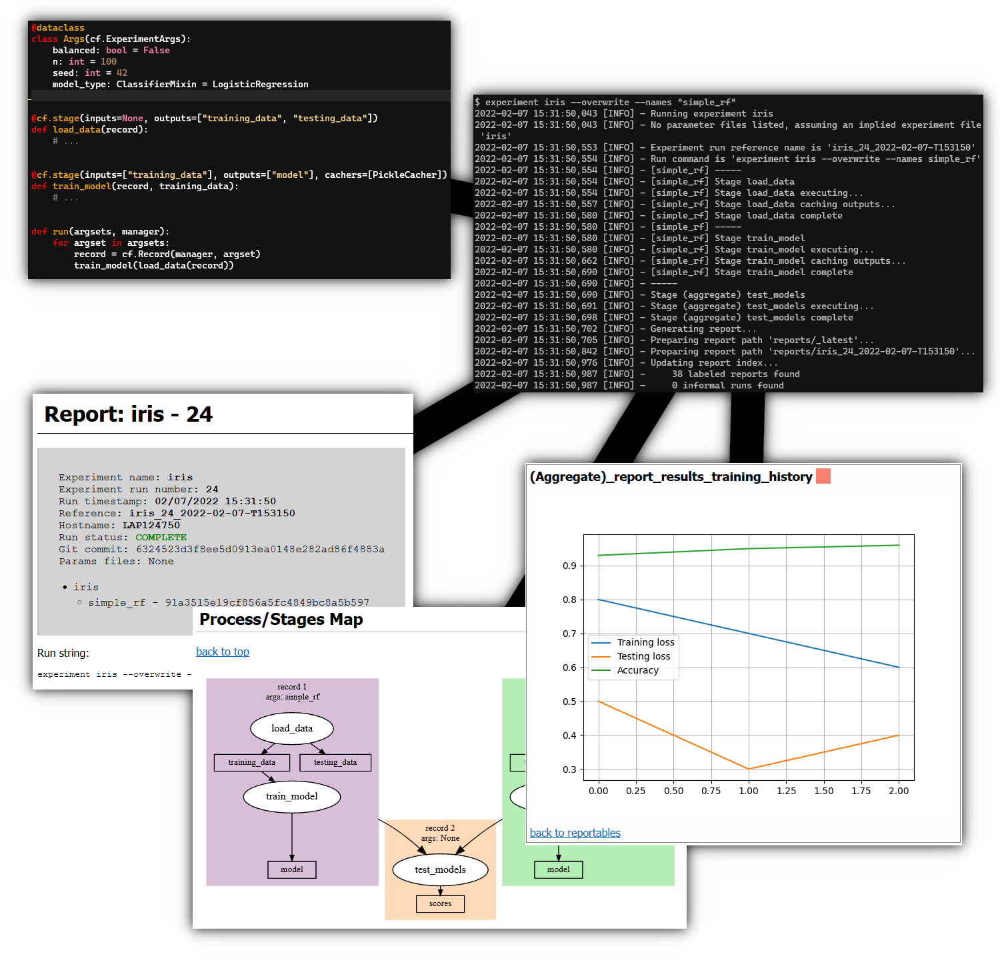

.. Curifactory documentation master file, created by
   sphinx-quickstart on Tue Jun 22 12:57:24 2021.
   You can adapt this file completely to your liking, but it should at least
   contain the root `toctree` directive.

Curifactory Documentation
=======================================

Curifactory is a library and CLI tool designed to help organize and manage
research experiments in python.

Experiment management must fulfill several tasks, including experiment orchestration,
parameterization, caching, reproducibility, reporting, and parallelization.
Existing projects such as MLFlow, MetaFlow, Luigi, and Pachyderm
support these tasks in several different ways and to various degrees.
Curifactory provides a different opinion, with a heavier focus on supporting general
research experiment workflows for individuals or small teams working primarily
in python.

Features
--------

* Adds a CLI layer on top of your codebase, a single entrypoint for running experiments
* Automatic caching of intermediate data
* Jupyter notebook output for further exploration of an experiment run
* Docker container output with copy of codebase, conda environment, full experiment run cache, and jupyter run notebook
* HTML report output from each run with graphviz-rendered diagram of experiment
* Easily report plots and values to HTML report
* Configuration files are python scripts, allowing programmatic definition, parameter composition, and parameter inheritance
* Output logs from every run
* Run experiments directly from CLI or other python code, notebooks, etc.

.. toctree::
    :maxdepth: 2
    :caption: Usage

    installation.rst
    getting_started.rst
    components.rst
    parameters.rst
    cache.rst
    reports.rst
    config.rst
    cli_guide.rst
    tips.rst
    example.rst
    cookbook.rst
    migration.rst

.. toctree::
    :maxdepth: 2
    :caption: API

    args.rst
    caching.rst
    docker.rst
    experiment.rst
    manager.rst
    procedure.rst
    project.rst
    record.rst
    reporting.rst
    staging.rst
    store.rst
    utils.rst

Indices and tables
==================

* :ref:`genindex`
* :ref:`modindex`
* :ref:`search`
