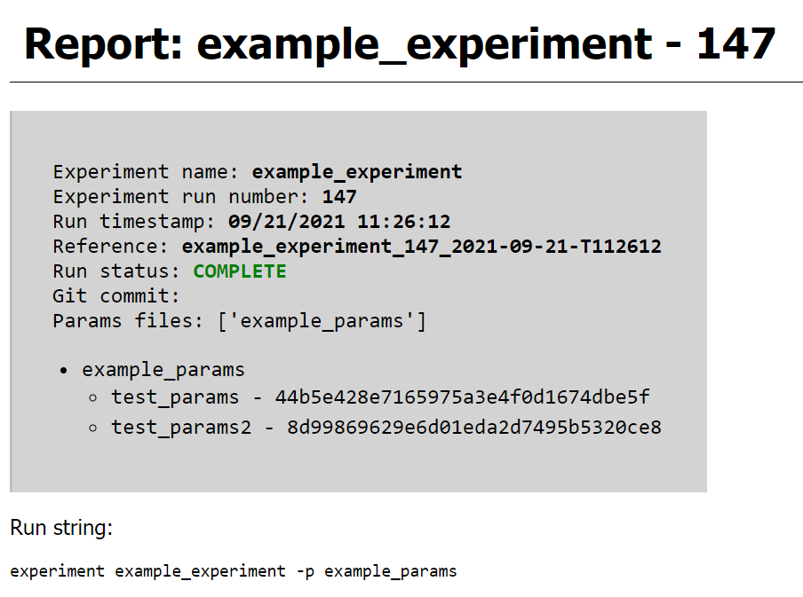

Reports
=======

Every experiment that runs to completion generates an HTML run report stored in a run-specific folder in
the ``reports/`` directory, and adds a listing with a link to it in the main reports ``index.html``.

Report structure
----------------

Reports have 5 sections:

* **Experiment metadata** - this includes information about the run, such as timestamp, current git commit hash, and
  the list of hashes of the parameter sets that were used. Additionally, the CLI command that was used to run the experiment
  is included, as well as the command necessary to directly reproduce it if run with :code:`--full-store`.
* **Reportables** - any reportables added in any of the stages are rendered here, along with a ToC for them. By default
  they are ordered by the record they came from, but this can be changed with :ref:`Reportable Groups`.
* **Map** - assuming graphviz is installed, an svg "graph" or rough DAG of the experiment is displayed, with ovals
  representing each stage, and the boxes representing the outputs from that stage. This maps the flow of
  data from one stage to another. Each colored box corresponds to a record, and the name of the parameter set used in that
  record is displayed at the top.
* **Stage Detail** - this renders an svg graph with graphviz similar to the map, but each record is displayed separately,
  and shows additional details for each piece of data represented. It attempts to preview the content of the data, and
  will try to show the length or shape of it, as relevant. If the data is cached, it will show the full path to the
  cached file.
* **Parameter sets** - the final section is a full JSON dump of all parameter sets used in the run.

Examples of these sections are displayed below:

    An experiment metadata section. The hashes are the hash strings that are used to prefix
    cached data from records using that parameter set.

.. figure:: ../images/report_reportables.png

    A reportables section, in this case most reportables came from an aggregate stage named
    "compile_results", and one from "report_results", reflected in the title for each
    reportable. The small colored box to the right of each reportable corresponds to the
    color of the record it came from as shown in the maps below.

.. figure:: ../images/report_map.png

    An example experiment map. The :code:`compile_results` stage is an aggregate stage in this
    case, and you can visually identify which records are passed into it.

.. figure:: ../images/report_map_complicated.png

    A more complicated experiment map. This can be a useful tool to help determine where
    specific variables in a record state are coming from and where they're used.

    An example of a record in the stage detail section. In order, the details for each
    piece of data show 1) the name, 2) the data type and preview (and length or shape if
    possible), and 3) the path to the cache file if it was cached.

Reportables
-----------

Reportables are renderable things you can create inside of stages that show up in the
report, making it easier to get information and results output for analysis without
having to dig through cached data to visualize it. This can include things like tables,
plots, etc.

The design for reportables is similar to cacheables in that there are several
pre-defined types of reportables as part of Curifactory, and you can define custom ones
by extending the base :code:`Reportable` class.

The pre-defined reportable classes are:

* :code:`DFReporter` - Renders an HTML table for a given pandas dataframe.
* :code:`FigureReporter` - Renders a given matplotlib figure.
* :code:`HTMLReporter` - Directly renders given HTML.
* :code:`JsonReporter` - Renders an indented JSON dump of a dictionary.
* :code:`LinePlotReporter` - Creates and renders a matplotlib figure for passed data.

Check the :ref:`Reporting` API documentation for each of these for more information on individual usage.

Reportables are added to the report by calling :code:`record.report(REPORTABLE_CLASS(...))` and optionally
providing a name and group string. (A reportable with no name is simply assigned a 0-based index number.)

When defining a custom reportable, you must extend the :class:`reporting.Reportable <curifactory.reporting.Reportable>`
class and override the :code:`html()` function, which should return the HTML snippet to be included in the
report. Depending on the nature of the reportable, you may also wish to override the
:code:`render()` function as well. If a reportable relies on some form of external file,
such as an image or figure, implement :code:`render()` to save it (using this class's
:code:`path` variable as the directory), and then reference it in the output from
:code:`html()`. The internal reporting mechanisms handle calling both of these functions
as needed.

A simplified example of the :code:`FigureReporter` is shown here:

.. code-block:: python

    class FigureReporter(Reportable):
        def __init__(self, fig, name=None, group=None):
            self.fig = fig
            super().__init__(name=name, group=group)

        def render(self):
            self.fig.savefig( f"{self.path}{self.name}.png")

        def html(self):
            return f""

Reportable groups
-----------------

By default, the reportables are rendered to the report grouped by record and in the order
in which they are added. However, if there are a lot of things reported in each record, it can
sometimes be difficult to compare specific reportables across the records. This can be
addressed by specifying the :code:`group` string parameter in the reportable constructors. All
reportables with the same group value are rendered next to eachother in the output report.
